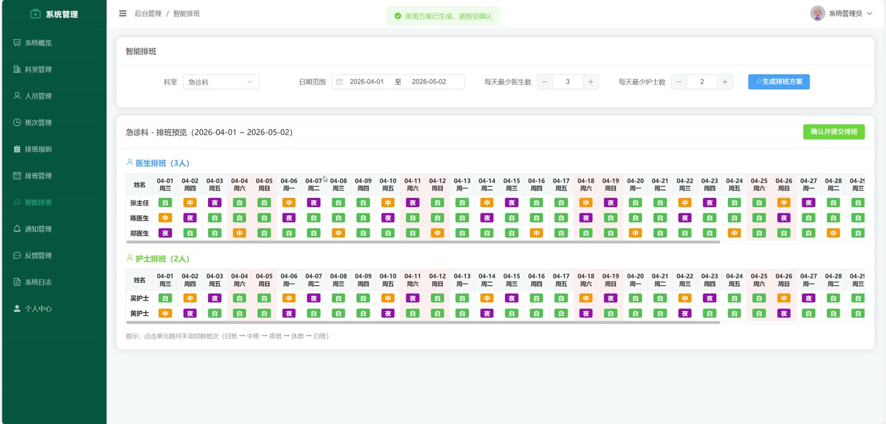
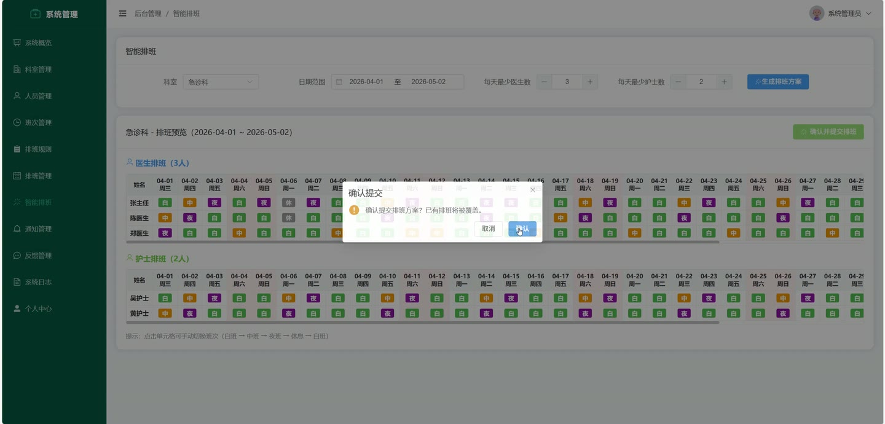
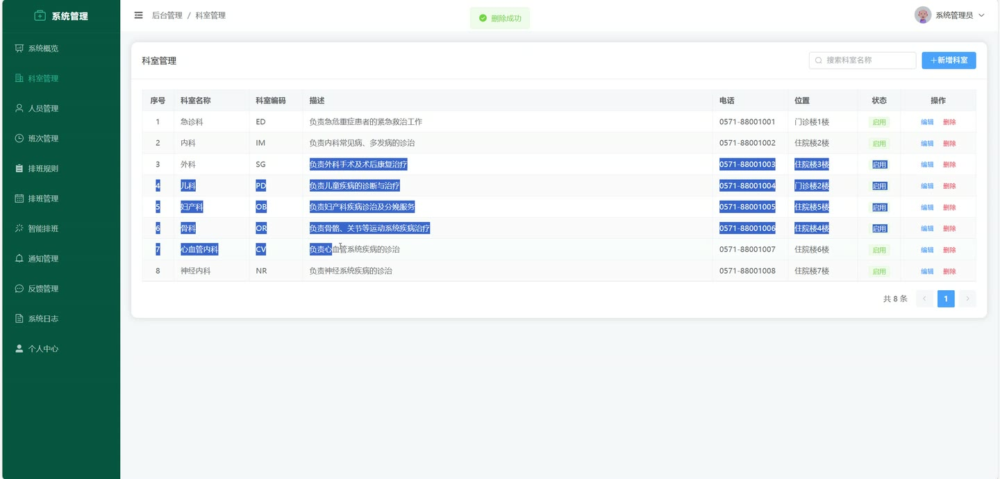
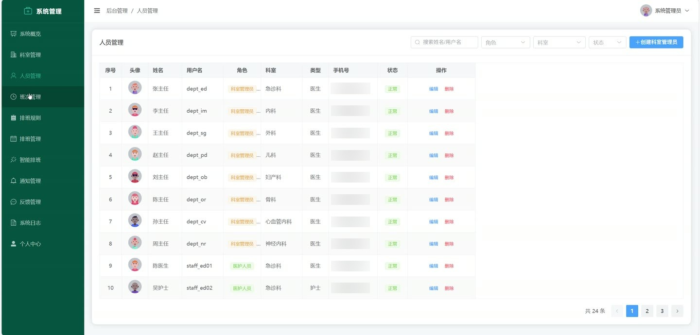
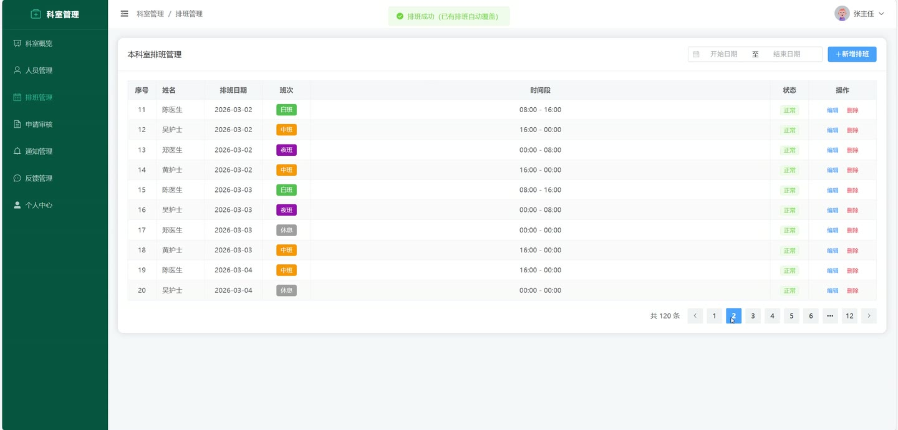

# (附文档)Springboot3+Vue3+MySQL 医院人员管理系统

**技术栈**：Springboot3、Vue3、MySQL

### 系统简介

本系统是一套基于 Spring Boot 3 + Vue 3 + MySQL 的医院人员排班管理系统，采用前后端分离架构。系统支持超级管理员、科室管理员、医护人员三种角色，提供科室管理、医护人员注册审核、排班管理、排班规则配置、智能排班、排班申请审批、通知公告发布与阅读、反馈提交与回复、收藏管理、操作日志审计等核心功能，帮助医院实现排班工作的数字化与规范化管理。
 
### 核心功能
 
### 普通用户端

 
- 查看个人排班信息：按日期范围筛选，展示本人排班日期、班次名称、所属科室、排班状态 
- 提交排班申请：选择申请类型（调班/换班/请假）、目标日期、目标班次、目标人员（换班必填），提交后进入待审核状态 
- 查看我的申请列表：按申请类型、审核状态筛选，查看申请详情、审核意见、审核人 
- 查看通知公告：按科室、类型筛选，查看公告标题、内容、发布人、发布时间，自动标记已读 
- 收藏通知/排班：点击收藏按钮添加收藏，在收藏列表查看已收藏的通知标题、排班日期与班次 
- 提交反馈：选择反馈类型、关联科室，填写反馈内容并提交 
- 查看我的反馈列表：按科室、类型、状态筛选，查看管理员回复内容与回复时间 
- 修改个人信息：更新真实姓名、性别、手机号、邮箱、头像、人员类型（医生/护士）、职称 
- 修改密码：输入原密码与新密码完成密码更新 
- 查看科室排班统计：按月份查看本科室各班次占比、每日排班人数、排班总数
 
### 管理员端

 
- 用户管理：按角色、科室、状态、关键词分页查询用户列表，查看用户详情（含科室名称） 
- 审核医护人员注册：审核待审核状态的医护人员账号，通过后账号可正常登录 
- 创建科室管理员：填写用户名、密码、所属科室等信息，直接创建已启用的科室管理员账号 
- 更新用户信息：修改任意用户的角色、科室、状态、人员类型等信息 
- 删除用户：删除指定用户账号 
- 科室管理：新增/编辑/删除科室，设置科室名称、排序号、启用状态 
- 班次类型管理：新增/编辑/删除班次，设置班次名称、颜色标识、启用状态 
- 排班规则管理：新增/编辑/删除排班规则，设置规则名称、最大连续工作天数、每周最大夜班次数、启用状态 
- 排班管理：按科室、人员、日期范围分页查询排班，新增/编辑/删除单条排班记录 
- 批量创建排班：选择科室、人员、班次、日期范围，一次性批量创建多条排班记录 
- 智能排班：选择科室、日期范围、最少医生数、最少护士数，系统自动生成排班方案（预览不入库），确认后批量提交 
- 查看全院排班统计概览：展示各科室人员数量、本月排班数量、全院总人数、总科室数、待处理申请数、各类申请占比 
- 排班申请审批：按科室、类型、状态筛选申请列表，审核通过/驳回申请并填写审核意见；通过后自动更新排班（调班修改班次、换班交换班次、请假改为休息） 
- 通知公告管理：发布/编辑/删除通知，设置通知标题、内容、类型、关联科室（全院或指定科室） 
- 反馈管理：按科室、用户、类型、状态筛选反馈列表，回复用户反馈并标记为已处理 
- 删除反馈：删除指定反馈记录 
- 操作日志查询：按用户名、操作状态分页查看系统操作日志，记录操作人、操作内容、操作时间、IP地址
 
### 技术栈

  后端框架 Spring Boot 3   ORM MyBatis-Plus   权限认证 JWT（jjwt）   密码加密 BCrypt   前端框架 Vue 3   状态管理 Pinia   前端路由 Vue Router   UI 组件库 Element Plus   HTTP 请求 Axios   构建工具 Vite   数据库 MySQL 8   项目构建 Maven 
 
### 交付内容

 
- 后端完整源码 
- 前端完整源码 
- 数据库初始化脚本 
- 万字文档

## 界面展示

---

## 获取完整源码 + 万字文档

本仓库为项目介绍页。**完整前后端源码、数据库初始化脚本、万字项目文档**，请加微信 `kangkangcode`，或访问 [codekk.top](http://codekk.top) 获取。

可作课程设计 / 毕业设计参考，支持远程部署调试。